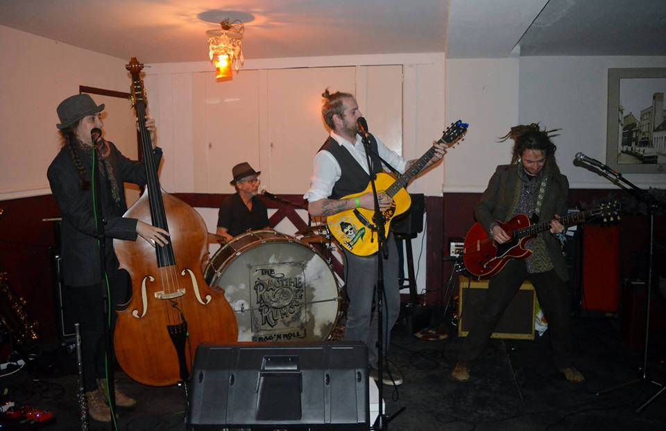

<!-- Main -->

<!-- Two -->
<section id="two" class="spotlights">
	<!--<section>
		
		

			

				<header class="major">
					<h3>The Ragtime Rumours - EP 1</h3>
				</header>
				
Written, produced and engineered by The Ragtime Rumours at Kink Studio. 

                Love And Lust &nbsp;<audio id="audio-player" src="assets/media/love_and_lust.mp3" type="audio/mp3" controls="controls"></audio>
			

			

                Ain't Nobody &nbsp;&nbsp;&nbsp;<audio id="audio-player" src="assets/media/aintnobody.mp3" type="audio/mp3" controls="controls"></audio>
			

		

	</section> -->
	
	<!--image section -->

    

        

            

            

            

            <!-- Break -->
            

            

            

            <!-- Break -->
            

            

            

        

    

</section>

<!-- Three -->
<section id="three">
	

		<!--<header class="major">
			<h2>SounCloud</h2>
		</header> 
		
See 
 -->
			<iframe class="media-audio" height="350" scrolling="no" frameborder="no" src="https://w.soundcloud.com/player/?url=https%3A//api.soundcloud.com/playlists/222275049&amp;color=%233a181a&amp;auto_play=false&amp;hide_related=false&amp;show_comments=true&amp;show_user=true&amp;show_reposts=false&amp;show_teaser=true"></iframe>
			
			<!--<iframe class="media-audio" style="border: 0; height: 350px;" src="https://bandcamp.com/EmbeddedPlayer/album=2980624483/size=large/bgcol=ffffff/linkcol=333333/artwork=none/transparent=true/" seamless><a href="http://thimogijezen.bandcamp.com/album/the-ragtime-rumours-aint-nobody">The Ragtime Rumours - Ain&#39;t Nobody by Thimo Gijezen</a></iframe> -->
	

</section>

