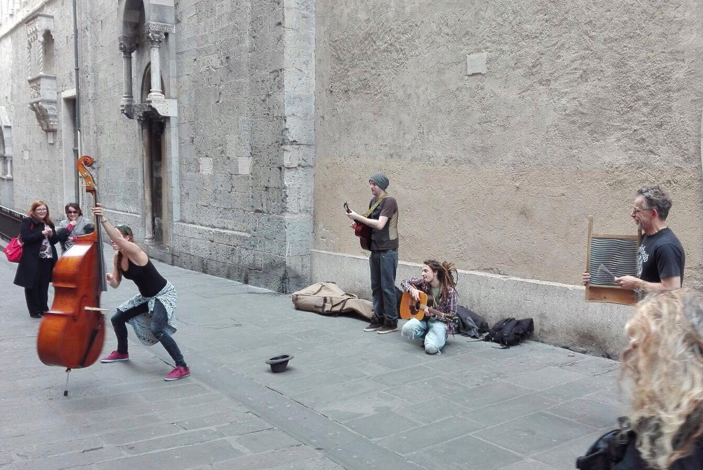
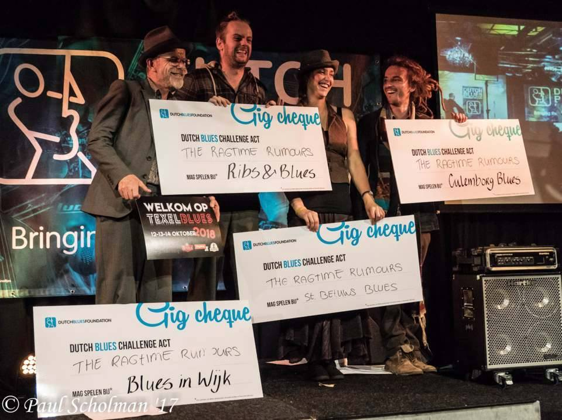
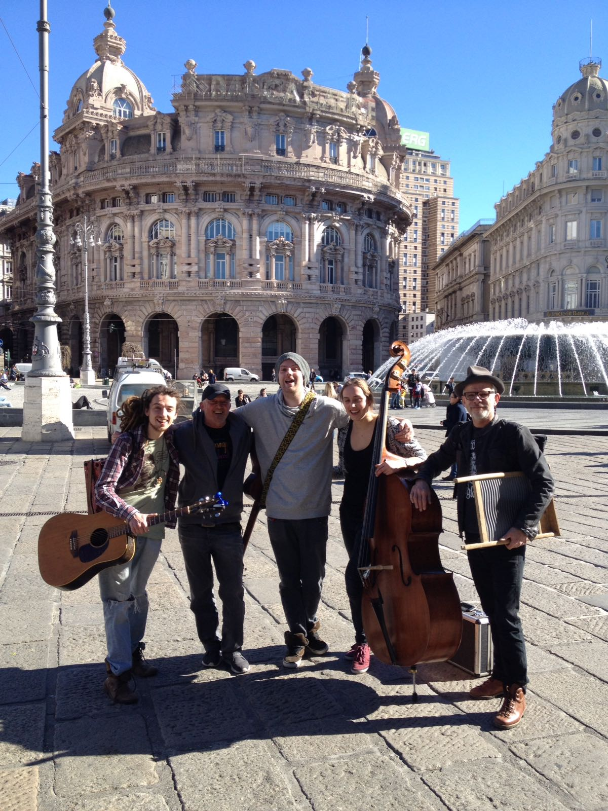
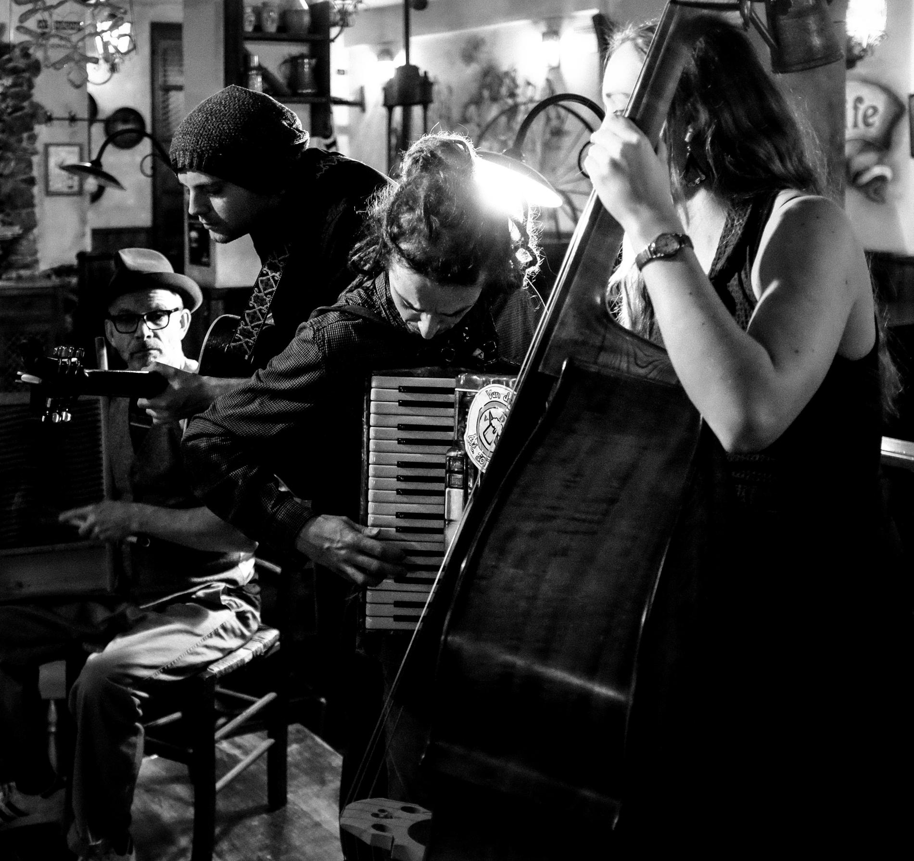
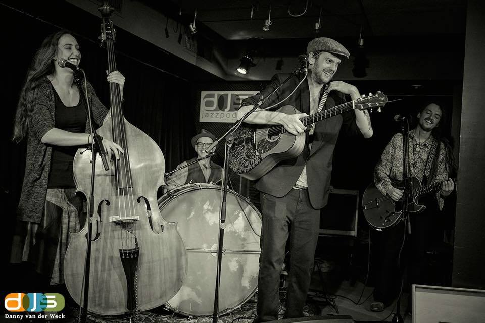

<!-- Main -->

<!-- One -->
<section id="one">
    

        

            

                <header class="major">
                    <h4>The Ragtime Rumours - Love & Lust</h4>
                </header>
                
                <video width="90%" controls>
                    <source src="assets/media/the_ragtime_rumours_love_lust.mp4#t=1,100" type="video/mp4">
                    Your browser does not support the video tag.
                </video>
            

            
            

                <header class="major">
                    <h4>The Ragtime Rumours - Ain't Nobody</h4>
                </header>
                
                <video width="90%" controls preload="metadata">
                    <source src="assets/media/the_ragtime_rumours-ain't_nobody.webm#t=3,100" type="video/webm">
                    <source src="https://kaosx.us/media/the_ragtime_rumours-ain't_nobody.mp4#t=3,100" type="video/mp4">
                    Your browser does not support the video tag.
                </video>
            

        

    

</section>

<!--image section -->
<section id="two">
    

        

            

            

            

            <!-- Break -->
            

            

            

            <!-- Break -->
            

            

            

            <!-- Break -->
            

            

            

        

    

</section>

<!-- Spotify player -->
<section id="three">
	

        
            <iframe class="media-audio" src="https://open.spotify.com/embed?uri=spotify:album:7JZJE36cFkciuXvUM1aM2B" width="300" height="380" frameborder="0" allowtransparency="true"></iframe>

	

</section>

